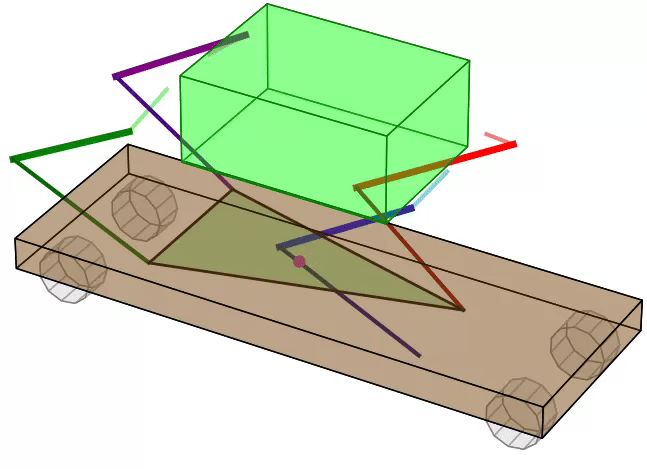
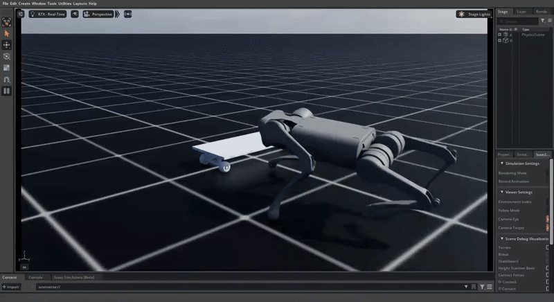

# 🛹 Quadrupedal Skateboarding

**Open repository for the paper "The robot goes skateboarding"**

## Demonstrations

### Propulsion: Simulation vs Reality

<table>
  <tr>
    <td align="center"><b>Simulation</b></td>
    <td align="center"><b>Real Robot</b></td>
  </tr>
  <tr>
    <td></td>
    <td></td>
  </tr>
  <tr>
    <td></td>
    <td></td>
  </tr>
</table>

### Steering Control

  

### Skateboard Mounting

  

*Related work: [Quadruped Skateboard Mounting](https://github.com/dancher00/quadruped-skateboard-mounting) | [arXiv Paper](https://www.arxiv.org/abs/2505.06561)*

## License

This project is licensed under the terms specified in the [LICENSE](LICENSE) file.