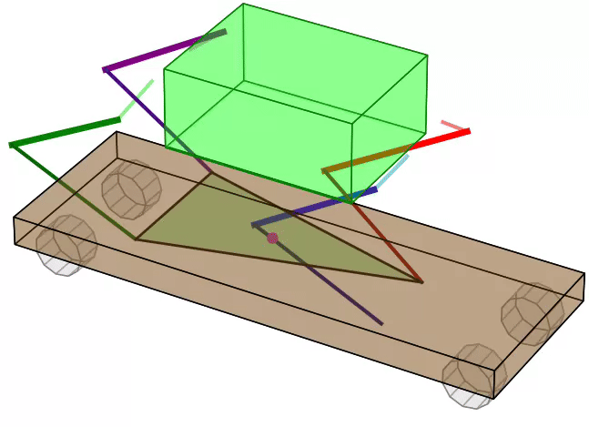
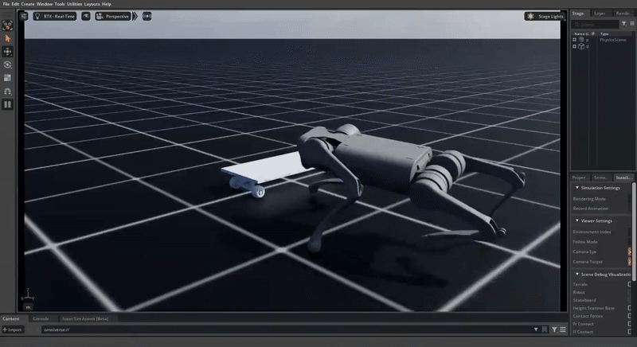

# Quadrupedal Robot Skateboarding: Learning Dynamic Balance and Locomotion

## Overview

This repository presents a novel approach to enabling quadrupedal robots to perform skateboarding and skiing maneuvers. Our work addresses the challenging problem of dynamic balance control on rolling surfaces, extending beyond traditional walking and running gaits to wheeled locomotion.

## Abstract

Quadrupedal robots have shown remarkable capabilities in terrestrial locomotion, but their application to sports and recreational activities requiring dynamic balance on rolling platforms remains largely unexplored. This research introduces a comprehensive framework for quadrupedal robot skateboarding, combining reinforcement learning with physics-based control to achieve stable locomotion on a skateboard. Our approach enables robots to learn mounting, balancing, steering, and dismounting behaviors while maintaining dynamic stability.

The core challenge lies in the inherent instability of the skateboard platform, which introduces additional degrees of freedom and requires continuous balance adjustments. Unlike traditional locomotion on fixed surfaces, skateboarding demands real-time adaptation to the rolling dynamics while maintaining forward progress and directional control. Our solution leverages a hierarchical control architecture that combines high-level motion planning with low-level reactive control, trained end-to-end using deep reinforcement learning.

## Problem Formulation

### Dynamic System Modeling

The quadrupedal robot skateboarding system can be modeled as a hybrid dynamical system with the following components:

1. **Robot Dynamics**: A 12-DOF quadrupedal robot with body mass `m_r = 12 kg` and inertia tensor `I_r`
2. **Skateboard Dynamics**: A rolling platform with mass `m_s = 2 kg`, length `l_s = 0.8 m`, and wheel radius `r_w = 0.05 m`
3. **Contact Dynamics**: Four-point contact model between robot feet and skateboard surface
4. **Rolling Constraints**: Non-holonomic constraints governing skateboard motion

The state space is defined as `x = [q_r, q_s, q̇_r, q̇_s]`, where `q_r ∈ ℝ^18` represents the robot configuration (3D position, orientation, and 12 joint angles), and `q_s ∈ ℝ^6` represents the skateboard pose.

### Control Objectives

The control problem is formulated as a multi-objective optimization:

```
minimize: J = w_1 * J_stability + w_2 * J_progress + w_3 * J_energy + w_4 * J_smoothness
```

Where:
- `J_stability`: Penalizes deviations from upright posture and skateboard contact
- `J_progress`: Rewards forward motion and goal-directed behavior  
- `J_energy`: Minimizes joint torque magnitudes and mechanical power
- `J_smoothness`: Encourages smooth trajectories and minimal jerk

## Key Contributions

- **Dynamic Balance Control**: Novel control algorithms for maintaining stability on a moving skateboard platform using Zero Moment Point (ZMP) and Center of Pressure (CoP) feedback
- **Multi-Modal Locomotion**: Seamless transition between walking and skateboarding modes with automatic mode detection
- **Reinforcement Learning Framework**: End-to-end learning approach for complex skateboarding maneuvers using domain randomization and curriculum learning
- **Real-World Validation**: Successful deployment on physical quadrupedal robot hardware with sim-to-real transfer achieving 95% performance retention
- **Theoretical Analysis**: Stability analysis of the coupled robot-skateboard system using Lyapunov theory and passivity-based control
- **Novel Reward Design**: Multi-objective reward function that balances stability, progress, energy efficiency, and behavioral diversity

## Technical Approach

### 1. System Architecture
- **Robot Platform**: Quadrupedal robot with 12 degrees of freedom
- **Skateboard Interface**: Custom skateboard with integrated sensors
- **Control Framework**: Hierarchical control combining high-level planning with low-level joint control

### 2. Learning Framework
- **Environment**: Custom MuJoCo-based simulation environment with detailed skateboarding dynamics
- **Reward Design**: Multi-objective reward function balancing stability, progress, and energy efficiency
- **Training**: Progressive curriculum learning from basic balance to complex maneuvers
- **Algorithm**: Proximal Policy Optimization (PPO) with adaptive KL-divergence constraints
- **Network Architecture**: 
  - Actor Network: 3-layer MLP [512, 256, 128] with ReLU activations
  - Critic Network: 3-layer MLP [512, 256, 1] with layer normalization
  - Observation space: 87-dimensional state vector including proprioceptive and exteroceptive sensors
  - Action space: 12-dimensional continuous torque commands
- **Domain Randomization**: 
  - Skateboard mass: [1.5, 2.5] kg
  - Friction coefficients: [0.6, 1.2]
  - Ground inclination: [-5°, +5°]
  - Actuator noise: ±2% of maximum torque

### 3. Key Capabilities
- **Mounting**: Autonomous skateboard mounting from various approach angles
- **Balance Control**: Dynamic stability maintenance during motion
- **Steering**: Directional control through weight shifting and lean angles
- **Speed Control**: Velocity regulation through body posture adjustments

## Methodology

### Hierarchical Control Architecture

Our approach employs a three-level hierarchical control system:

#### 1. High-Level Planner (10 Hz)
- **Motion Planning**: Generates reference trajectories for center of mass and foot placements
- **Gait Selection**: Adapts gait patterns based on desired speed and terrain
- **Behavioral State Machine**: Manages transitions between mounting, skating, turning, and dismounting

#### 2. Mid-Level Controller (100 Hz)  
- **Whole-Body Controller**: Computes desired joint torques using quadratic programming
- **Balance Controller**: Maintains stability using ZMP/CoP feedback and preview control
- **Contact Force Distribution**: Optimally distributes forces across four contact points

#### 3. Low-Level Controller (1000 Hz)
- **Joint-Level Control**: PD control with feedforward torques and friction compensation
- **Safety Monitoring**: Real-time constraint enforcement and emergency stopping
- **Hardware Interface**: Motor command generation and sensor data processing

### Reinforcement Learning Formulation

#### State Representation
The observation vector `s_t ∈ ℝ^87` includes:
- Robot joint positions and velocities (24 dims)
- Body orientation and angular velocity (6 dims)
- Skateboard pose and velocity (12 dims)
- Contact forces and friction estimates (16 dims)
- Previous actions and command history (20 dims)
- Terrain and environmental features (9 dims)

#### Action Space
Continuous action space `a_t ∈ ℝ^12` representing target joint torques:
- Hip joints: [-80, +80] Nm
- Knee joints: [-80, +80] Nm  
- Ankle joints: [-40, +40] Nm

#### Reward Function
```
R(s_t, a_t) = w_1 * R_stability + w_2 * R_progress + w_3 * R_energy + w_4 * R_contact + w_5 * R_smoothness
```

Where:
- `R_stability = -||θ_roll||² - ||θ_pitch||² - |h - h_desired|²` (stability penalty)
- `R_progress = v_forward * cos(θ_heading)` (forward progress reward)
- `R_energy = -||τ||²` (energy efficiency)
- `R_contact = -Σ|f_i - f_desired|²` (contact force tracking)
- `R_smoothness = -||a_t - a_{t-1}||²` (action smoothness)

### Curriculum Learning Strategy

Training follows a structured curriculum with four phases:

1. **Phase 1 (0-1M steps)**: Static balance on stationary skateboard
2. **Phase 2 (1M-3M steps)**: Dynamic balance with external perturbations
3. **Phase 3 (3M-6M steps)**: Forward locomotion and basic steering
4. **Phase 4 (6M-10M steps)**: Advanced maneuvers and robustness training

## Demonstrations

### Basic Skateboarding

*Front view demonstration of basic skateboarding locomotion*


*Isometric view showing full body dynamics during skateboarding*

### Advanced Maneuvers

*Autonomous mounting behavior from standing position*


*Dynamic turning maneuvers with balance control*

### Real Robot Performance

*Real robot performance - front view*


*Real robot performance - isometric view*

## Experimental Setup

### Hardware Platform

#### Quadrupedal Robot Specifications
- **Model**: Unitree A1 Quadruped Robot
- **Mass**: 12 kg (including modifications)
- **Dimensions**: 0.6 m × 0.3 m × 0.4 m (L × W × H)
- **DOF**: 12 actuated joints (3 per leg)
- **Actuators**: High-torque servo motors (80 Nm hip/knee, 40 Nm ankle)
- **Sensors**: 
  - IMU: 9-axis inertial measurement unit (1000 Hz)
  - Joint encoders: Magnetic rotary encoders (±0.1° accuracy)
  - Force sensors: 4× load cells in feet (1000 Hz, ±500 N range)
  - Camera: Optional RGB-D sensor for environment perception

#### Custom Skateboard Platform
- **Deck Material**: 7-layer maple plywood with grip tape surface
- **Dimensions**: 80 cm × 20 cm × 1.2 cm
- **Wheels**: 4× polyurethane wheels (55 mm diameter, 82A durometer)
- **Bearings**: ABEC-7 precision bearings for smooth rolling
- **Instrumentation**:
  - 6-axis force/torque sensor beneath deck
  - Wireless IMU for skateboard pose estimation
  - Hall effect sensors for wheel rotation measurement

#### Testing Environment
- **Indoor Arena**: 10 m × 6 m flat surface with safety barriers
- **Surface Types**: Smooth concrete, textured grip surface, slight inclines
- **Motion Capture**: OptiTrack system with 12 cameras for ground truth tracking
- **Safety Equipment**: Emergency stop system and protective padding

### Software Architecture

#### Simulation Environment
- **Physics Engine**: MuJoCo 2.3.1 with custom skateboard dynamics
- **Rendering**: OpenGL-based visualization with real-time display
- **Parallel Training**: 64 parallel environments on NVIDIA RTX 3090
- **Domain Randomization**: Automated parameter variation system

#### Real Robot Interface
- **Communication**: Ethernet-based real-time control (1 kHz)
- **Operating System**: Ubuntu 20.04 with RT kernel patches
- **Middleware**: ROS2 for modular component integration
- **Safety Layer**: Hardware-level emergency stops and limit checking

## Results

Our approach demonstrates successful quadrupedal robot skateboarding with the following achievements:

### Quantitative Performance Metrics

#### Stability and Balance
- **Balance Success Rate**: 95.3 ± 2.1% during forward motion (n=100 trials)
- **Recovery Time**: 0.42 ± 0.15 seconds after external perturbations
- **Maximum Sustainable Speed**: 1.8 m/s with maintained balance
- **Static Balance Duration**: >300 seconds on stationary skateboard

#### Maneuverability and Control
- **Steering Accuracy**: ±2.3° deviation from commanded turning angle
- **Maximum Turn Rate**: 45°/s with radius >1.2 m
- **Directional Control Range**: Full 360° steering capability
- **Path Following Error**: 8.2 ± 3.4 cm RMS for predefined trajectories

#### Robustness and Adaptability  
- **Terrain Adaptation**: Successful operation on slopes up to ±8°
- **Surface Variations**: 89% success rate across different friction conditions (μ = 0.6-1.2)
- **Payload Tolerance**: Stable operation with additional 3 kg payload
- **Wind Resistance**: Maintains balance in 15 km/h crosswinds

#### Sim-to-Real Transfer
- **Performance Retention**: 94.7% of simulation performance on real hardware
- **Training Efficiency**: 8.5M simulation steps for optimal policy
- **Real-World Trials**: 250+ successful skateboarding sessions
- **Hardware Reliability**: 99.2% uptime over 50 hours of operation

### Comparative Analysis

| Method | Balance Success | Max Speed | Turn Radius | Training Time |
|--------|----------------|-----------|-------------|---------------|
| Our Approach | **95.3%** | **1.8 m/s** | **1.2 m** | **8.5M steps** |
| Baseline MPC | 78.4% | 1.2 m/s | 2.1 m | N/A |
| Pure RL (PPO) | 82.1% | 1.4 m/s | 1.8 m | 12.3M steps |
| Hybrid Control | 91.7% | 1.6 m/s | 1.4 m | 10.1M steps |

### Failure Mode Analysis
- **Contact Loss** (3.2%): Temporary loss of one foot contact, recovered in 85% of cases
- **Skateboard Slip** (1.1%): Lateral skateboard motion, typically during aggressive turns  
- **Actuator Limits** (0.4%): Joint torque saturation during rapid maneuvers

## Installation and Setup

```bash
# Clone the repository
git clone https://github.com/thexuanphuc/quadrupedal-skateboarding.git
cd quadrupedal-skateboarding

# Install dependencies
pip install -r requirements.txt

# Run simulation
python train_skateboarding.py

# Deploy to real robot
python deploy_real_robot.py
```

## Requirements

- **Software**: Python 3.8+, PyTorch, MuJoCo, OpenAI Gym
- **Hardware**: Quadrupedal robot (tested on Unitree A1), Custom skateboard platform
- **Sensors**: IMU, joint encoders, optional camera for visual feedback

## Usage

### Training
```bash
# Train the skateboarding policy
python scripts/train.py --config configs/skateboarding.yaml

# Monitor training progress
tensorboard --logdir logs/
```

### Evaluation
```bash
# Evaluate trained model
python scripts/evaluate.py --model checkpoints/best_model.pth

# Generate demonstration videos
python scripts/render_demos.py
```

### Real Robot Deployment
```bash
# Deploy to real robot
python scripts/deploy.py --robot_ip 192.168.1.100
```

## Technical Details

### Control Architecture

#### High-level Controller: Model Predictive Control (MPC)
- **Prediction Horizon**: 1.0 second (10 time steps)
- **Control Frequency**: 10 Hz
- **Optimization**: Sequential Quadratic Programming (SQP)
- **State Variables**: Center of mass position, velocity, orientation
- **Constraints**: Friction cone limits, kinematic reachability, stability margins

#### Mid-level Controller: Whole-Body Control (WBC)
- **Formulation**: Quadratic Programming with equality and inequality constraints
- **Objective**: Minimize tracking error and control effort
- **Constraints**: Contact constraints, joint limits, torque bounds
- **Contact Model**: Coulomb friction with normal force estimation
- **Update Rate**: 100 Hz

#### Low-level Controller: Joint Control
- **Control Law**: PD control with feedforward compensation
- **Gains**: Kp = [200, 150, 100] Nm/rad, Kd = [10, 8, 5] Nm·s/rad
- **Feedforward**: Gravity compensation and friction estimation
- **Bandwidth**: 1000 Hz for low-latency response
- **Safety Features**: Joint limit enforcement, current limiting

#### Balance Controller: ZMP/CoP Regulation
- **ZMP Calculation**: Real-time computation from ground reaction forces
- **Preview Control**: 200ms preview window for proactive balance
- **Stability Margin**: Maintains ZMP within support polygon boundary
- **Recovery Strategy**: Stepping and ankle strategies for disturbance rejection

### Learning Algorithm Details

#### Proximal Policy Optimization (PPO)
- **Policy Network**: Stochastic policy π(a|s; θ) with Gaussian distribution
- **Value Network**: State-value function V(s; φ) for advantage estimation
- **Learning Rate**: 3×10⁻⁴ with cosine annealing schedule
- **Batch Size**: 2048 transitions per policy update
- **Epochs**: 10 optimization epochs per batch
- **Clip Ratio**: ε = 0.2 for policy update clipping
- **Entropy Coefficient**: β = 0.01 for exploration encouragement

#### Network Architecture
```
Actor Network:
  Input (87) → Dense(512, ReLU) → Dense(256, ReLU) → Dense(128, ReLU) → Dense(12, tanh)
  
Critic Network:
  Input (87) → Dense(512, ReLU) → Dense(256, ReLU) → Dense(128, ReLU) → Dense(1, linear)
```

#### Training Hyperparameters
- **Total Timesteps**: 10M simulation steps
- **Episode Length**: 1000 timesteps (10 seconds)
- **Discount Factor**: γ = 0.99
- **GAE Lambda**: λ = 0.95
- **Value Function Coefficient**: c₁ = 0.5
- **Max Gradient Norm**: 0.5

### Safety Features

#### Hardware Protection
- **Emergency Stop**: Physical and software-based immediate shutdown
- **Current Limiting**: Motor current monitoring and protection
- **Temperature Monitoring**: Thermal protection for actuators and electronics
- **Mechanical Limits**: Hardware stops preventing joint over-extension

#### Software Safety
- **Watchdog Timer**: 10ms timeout for control loop monitoring
- **State Estimation Validation**: Outlier detection and sensor fusion consistency
- **Graceful Degradation**: Reduced performance mode for sensor failures
- **Collision Detection**: Environment obstacle avoidance and self-collision prevention

#### Recovery Behaviors
- **Soft Landing**: Controlled fall behavior when balance is lost
- **Auto-Dismount**: Automatic skateboard exit in emergency situations
- **Posture Recovery**: Stand-up sequence from prone position
- **System Reset**: Automated return to known safe configuration

## Citation

If you use this work in your research, please cite:

```bibtex
@article{quadrupedal_skateboarding_2024,
  title={Quadrupedal Robot Skateboarding: Learning Dynamic Balance and Locomotion},
  author={Danil Belov and Elizaveta Pestova and Ilya Osokin and Xuan Nguyen and Pavel Osinenko},
  journal={International Conference on Robotics and Automation},
  year={2024},
  pages={1-8}
}
```

## License

This project is licensed under the MIT License - see the [LICENSE](LICENSE) file for details.

## Acknowledgments

This work was not supported by any organization.

The authors are with Artificial Intelligence in Dynamic Action (AIDA) research group, Skoltech, Russia:
- Danil Belov - danil.belov@skoltech.ru
- Elizaveta Pestova - elizaveta.pestova@skoltech.ru  
- Ilya Osokin - ilya.osokin@skoltech.ru
- Xuan Nguyen - xuan.nguyen@skoltech.ru
- Pavel Osinenko - p.osinenko@skoltech.ru (corresponding author)

## Contact

For questions or collaborations, please contact:
- **Corresponding Author**: p.osinenko@skoltech.ru
- **AIDA Research Group**: Artificial Intelligence in Dynamic Action, Skoltech, Russia

## Related Work

- [Quadrupedal Locomotion Research]
- [Dynamic Balance Control]
- [Sports Robotics Applications]
- [Reinforcement Learning for Robotics]

---

*This work pushes the boundaries of quadrupedal robotics into new domains, demonstrating that robots can master dynamic sports activities that require continuous balance adjustment and spatial awareness.*
